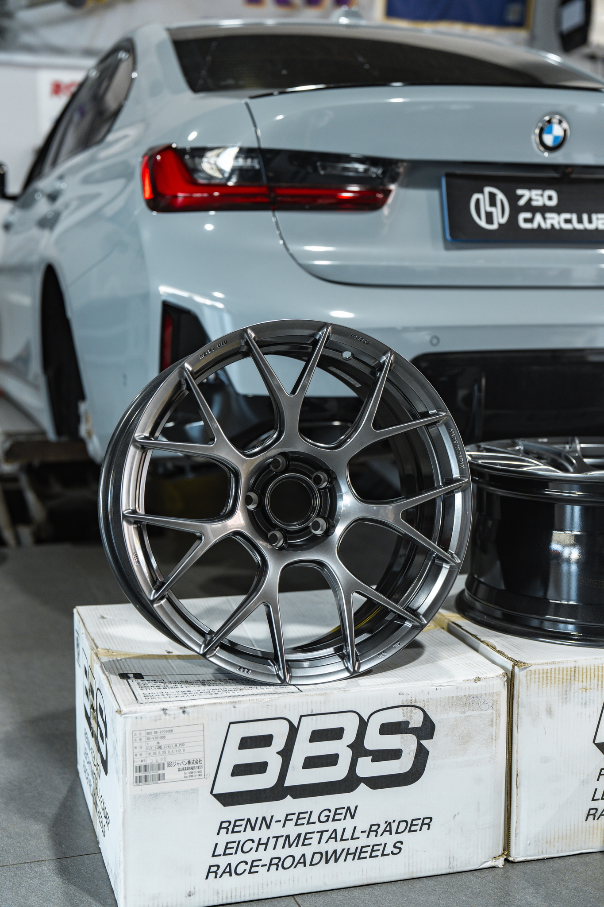

[上一篇](./bmw-330i-upgrades)里我刚升级完避震和刹车，分别选择了 KW V3 LE 和 AP9540 CZV 套装。然后就去跑了一圈高速体会升级后的操纵。那自然感受是极好的。本身从 SUV 换到轿车，我就感受到了重心降低带来的优势——车身侧倾和晃动明显减少。然而宝马这一代 G 底盘 3 系的调教在国内被华晨改得面目全非，变成了一辆有明显开船感的轿车。更换避震后显著提升了支撑性，在过弯时不再有车身明显倾斜的廉价开船感，刹停时松松垮垮的点头感也消失不见，取而代之的感想是：车身摇晃自然不可避免，但能够迅速拉住并稳定，这点就已经值回票价了。

其实原先是真没有想过那么快改轮毂，因为原厂的其实还算好看，并且也相对低调，所以最开始时没有列入改装计划，导致我选择的刹车也是体积整体较小的大四活塞 AP9540。

结果周末的时候，750 Car Club 的贺老师给我发消息说，要改轮毂赶快，7 月涨价。我一开始还心里嘀咕能涨多少，答曰涨一千，我自然以为是总价涨一千，还犹豫了两天。后来在 F1 观赛群里和群友说到这事，群友说代理商几个月前就发文涨价了，而且是一只轮毂涨一千以上，我吓了一条，赶紧联系贺老师安排轮毂。

在上一篇里也说到我纠结过是选用哪个轮毂。这里顺带说下我对比之后的一些个人观点

1. RAYS G025。这个其实是一开始第一眼看中的，但咨询后被告知 18 寸的 G025 数据并不好，所以国内压根没有人备货。如果要改 19 寸，那么不仅今后验车需要找黄牛，路上还容易被 1087，这也是我最开始就没有规划扩大轮毂的原因。更何况现在这套东西套在 19 寸轮毂里，看着就感觉空荡荡的，并不算合适，遂放弃。
2. BBS JP RI-A。这款也是我挺喜欢的，不过和群友说到这轮毂时，大家的反应都是国锻（国内仿制品）实在太多，就算上了正品、细节更优，也难以避免被人当做仿品。
3. [BBS RE-V7](https://bbs-japan.co.jp/en/products/1898/)。和 RI-A 同属于一眼相中的款式，并且相对而言仿品更少。额外的好处时这款轮毂还显大，数据更好，可以做到和车身平齐。最后在价格差不多的前提下选择了这款轮毂。不过这款颜色可选的少，官网列出的就只有金色、纯黑、亮银，还有就是这款钻石黑（实际更接近枪灰色）。

上一些美图。这次去换轮毂时是一个大晴天，出片明显比上次更好看了（也更晒了）。

实际确实如贺老师所说，RE-V7 尤其显大，甚至有种装了 19 寸轮毂的错觉。此外钻石黑的质感也非常不错，红色卡钳配上中心的红色 BBS 立体标也是骚得不行。

最后再来看看全车的侧面姿态。

降低 10mm 使得轮胎和轮眉基本保持了同心圆状态，配上新轮毂更加风骚。而且 3 系我看了好多次，依然觉得是标轴姿态要好看很多，更别说升级后操纵感的提升进一步拉大了差距。

哦顺带最后轮毂每只涨了 1500 CNY，这得硬看两个月的周末门诊才能补回来。谢谢贺老师提醒我早点下手（汗）

那么接下来就是各种周末遛车，等到首保后就可以开始加更好的机油，以及准备上一阶进一步提升点动力了。
